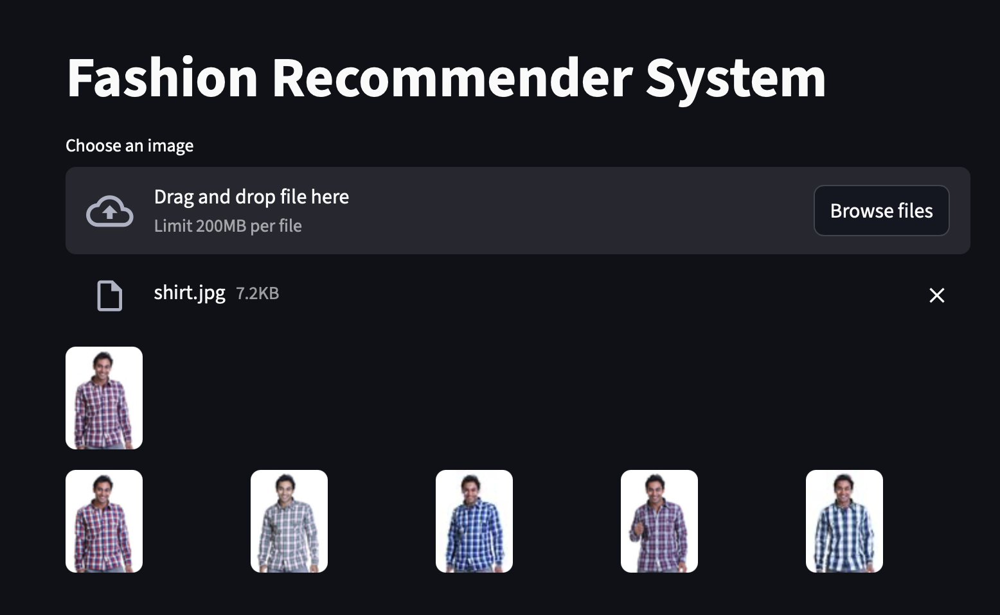

# Fashion Recommendation System

## Introduction
I built a **fashion recommendation system** that combines the power of **transfer learning** (ResNet-50) with **Annoy**, an optimized K-Nearest Neighbors algorithm, to deliver personalized recommendations based on user input images.  

Using **feature extraction** on over **45,000 fashion images** with ResNet-50, the system can understand visual patterns and styles. Then, by applying **KNN similarity search**, it finds the **top 5 closest matches** to a user’s input and displays them in a clean, interactive UI.  

This project highlights how **CNNs, transfer learning, and similarity search** can be used to create an accurate, efficient, and scalable recommendation system.

---

## Recommendation Engine — How It Works
The core idea is:
1. Train a **Convolutional Neural Network (CNN)** for feature extraction using **transfer learning with ResNet-50**.
2. Store embeddings of the fashion inventory in a database.
3. Use ** nearest neighbor search**.
4. Find the **top 5 most visually similar items** to the input image.

**Flow:**
- Pre-trained ResNet-50 extracts **deep features** from images.
- Features are stored for all items in the inventory.
- User uploads an image → the system extracts its features → finds similar items using euclidean distance between vectors → shows the top matches.

---

## Application Flow
1. **Image Upload** — User uploads a fashion image.
2. **Feature Extraction** — ResNet-50 processes the image to create a feature vector.
3. **Similarity Search** — Annoy finds the nearest neighbors using **cosine similarity**.
4. **Recommendation Output** — The top 5 matching fashion items are shown with their images.

---

## Convolutional Neural Networks (CNNs)
A **CNN** is a specialized neural network for visual data.  
In this project:
- We used **ResNet-50** pre-trained on **ImageNet**.
- Removed the classification head and replaced it with **Global Max Pooling** to get image embeddings.
- These embeddings represent the "style" and "look" of the image for matching.

---

## Dataset
- **Source:** [Kaggle Fashion Product Images Dataset](https://www.kaggle.com/paramaggarwal/fashion-product-images-dataset)
- **Size:** ~45,000 images.
- **Processing:** All images were resized to 224×224 and normalized before feature extraction.

---

## Experiments & Results
- **Transfer Learning** from ResNet-50 gave high-quality embeddings.
- **Annoy** allowed for fast retrieval even with large datasets.
- Achieved **high visual relevance** in recommendations with low latency.

Example:
- Input: Shirt image.
- Output: 5 visually similar shirts from the dataset.

